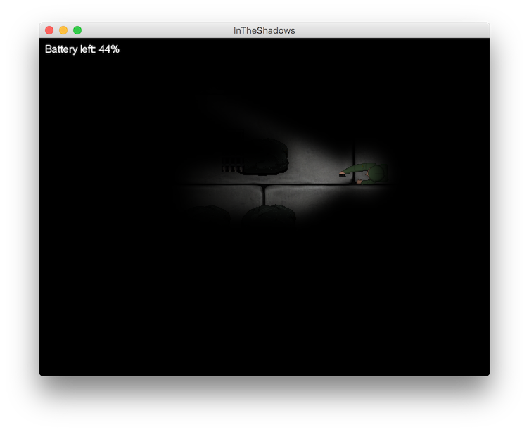

# In the shadows
Under [Athega](http://athega.se) codebase 2015 experimenterade jag med [libGDX](https://libgdx.badlogicgames.com/), [Box2D](http://box2d.org/) 
och [Box2DLights](https://github.com/libgdx/box2dlights). 

Resultat blev ett väldigt litet spel där målet är att hitta utgången innan batteriet till ficklampan tar slut.
 

Koden ligger på [Github](https://github.com/ragulin/InTheShadows).
